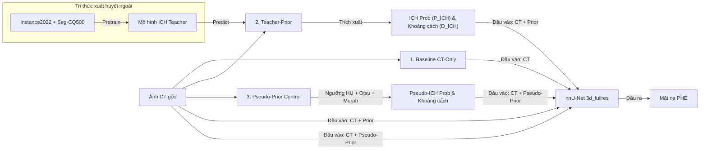

# Chuyển Giao Tri Thức Tiên Nghiệm Xuất Huyết Não Xuyên Bộ Dữ Liệu Trong Phân Đoạn Phù Não Quanh Ổ Xuất Huyết Trên Ảnh CT

Đánh giá hiệu quả của việc chuyển giao tri thức không gian từ vùng xuất huyết nội sọ (**ICH Prior**) sang phân đoạn phù não quanh ổ xuất huyết (**PHE**) trên ảnh CT sọ não không tiêm thuốc.

---

##  Câu hỏi nghiên cứu cốt lõi
> **Liệu thông tin tiên nghiệm không gian học từ các bộ dữ liệu xuất huyết nội sọ (ICH) ngoài có giúp cải thiện hiệu năng phân đoạn phù não quanh ổ xuất huyết (PHE) trên ảnh CT không tiêm thuốc hay không?**

---

##  Đóng góp chính của đề tài

1. **Khung đánh giá đối chứng xuyên miền dữ liệu (Cross-dataset evaluation):** Thiết lập một pipeline hoàn chỉnh đánh giá việc chuyển giao tri thức từ các bộ dữ liệu xuất huyết ngoài (`Instance2022`, `Seg-CQ500`) sang bài toán đích PHE trên tập dữ liệu `PHE-SICH-CT-IDS`.
2. **Thiết kế đa dạng kênh biểu diễn tiên nghiệm (Prior Representation):** Khảo sát và so sánh các dạng mã hóa thông tin không gian khác nhau bao gồm mặt nạ nhị phân (Binary Mask), bản đồ xác suất mềm (Soft Probability Map) và bản đồ biến đổi khoảng cách Euclidean (Distance Transform Map).
3. **Xây dựng nhánh đối chứng Heuristic vật lý (Pseudo-Prior Control):** Đề xuất thuật toán sinh prior tự động từ ảnh CT gốc bằng ngưỡng cường độ vật lý và hình thái học, làm mốc đối chứng mạnh để cô lập và làm rõ nguồn đóng góp thực sự của mô hình học sâu (Deep Learning).
4. **Đánh giá benchmark toàn diện các mạng phân đoạn y sinh:** Cung cấp kết quả so sánh định lượng trực tiếp giữa các kiến trúc mạng 3D SOTA bao gồm `nnU-Net`, `MedNeXt`, `DynUNet`, `SwinUNETR`, và `ResidualUNet3D`.

---

##  Phương pháp tiếp cận



### 1. Nhánh Baseline (CT-Only)
- Chỉ sử dụng ảnh CT gốc làm đầu vào. Đánh giá các kiến trúc mạng: `nnU-Net 3d_fullres`, `MedNeXt-S`, `MedNeXt-M`, `DynUNet`, `SwinUNETR`, `ResidualUNet3D`.

### 2. Nhánh Teacher-Prior (ICH-Prior)
- **Mô hình Teacher** (nnU-Net) được huấn luyện trên `Instance2022` và `Seg-CQ500` để nhận diện vùng xuất huyết (ICH).
- Trích xuất 2 kênh tiên nghiệm không gian trên tập PHE-SICH:
  - Bản đồ xác suất xuất huyết ($P_{\text{ICH}}$)
  - Bản đồ biến đổi khoảng cách Euclidean từ biên vùng xuất huyết ($D_{\text{ICH}} = \text{DT}(M_{\text{ICH}})$)
- Mô hình PHE downstream nhận đầu vào 3 kênh: `[CT, P_ICH, D_ICH]`.

### 3. Nhánh Pseudo-Prior Control
- Tạo vùng xuất huyết giả lập trực tiếp từ ảnh CT dựa trên heuristics vật lý:
  $$\text{Mask}_{\text{candidate}} = (\text{CT} \ge 55 \text{ HU}) \cap \text{Local-Otsu}$$
- Áp dụng phép toán hình thái học và sinh bản đồ khoảng cách để làm nhóm đối chứng không dùng học sâu.

---

##  Phân chia dữ liệu thực nghiệm

| Bộ dữ liệu | Nhãn / Phân vùng | Số ca | Vai trò |
| :--- | :--- | :---: | :--- |
| **PHE-SICH-CT-IDS** | NCCT / PHE Mask | 120 | Bài toán đích PHE (99 Train / 10 Val / 11 Test) |
| **Instance2022** | NCCT / ICH Mask | 100 | Huấn luyện ngoài cho ICH Teacher |
| **Seg-CQ500** | NCCT / ICH Mask | 51 | Huấn luyện ngoài cho ICH Teacher |

> [!IMPORTANT]
> **Tải xuống dữ liệu thực nghiệm:**
> Do kích thước dữ liệu ảnh y tế rất lớn, bộ dữ liệu đầy đủ không được lưu trữ trực tiếp trên kho mã nguồn GitHub này.
> Bạn vui lòng tải dữ liệu tại liên kết Google Drive sau: **[Google Drive Dataset Folder](https://drive.google.com/drive/folders/1k-0-4uVV3TMkiHbsonivTGEqQ1Ihc73L?usp=sharing)**.
> Sau khi tải về, hãy giải nén và đặt các thư mục con tương ứng vào thư mục trống `/data/` của dự án để chạy thực nghiệm.

---

##  Kết quả định lượng

### 1. Đánh giá các backbone phân đoạn (Baseline CT-Only trên PHE-SICH Test Set)
| Kiến trúc mạng | Dice (Mean) | IoU (Mean) | Trạng thái |
| :--- | :---: | :---: | :---: |
| **nnU-Net 3d_fullres** | **0.3941** | **0.2710** | **Baseline mạnh nhất** |
| MedNeXt-S | 0.3627 | 0.2390 | Thấp hơn |
| MedNeXt-M | 0.3600 | 0.2356 | Overfitting |
| DynUNet | 0.3430 | 0.2242 | Thấp hơn |
| ResidualUNet3D | 0.2161 | 0.1294 | Thấp |
| SwinUNETR | 0.1163 | 0.0668 | Không hội tụ |

### 2. Hiệu năng mô hình ICH Teacher trên tập dữ liệu ngoài
| Phiên bản | Dice (Mean) | Dice (Median) | Precision | Recall | Sai số thể tích (Abs) |
| :--- | :---: | :---: | :---: | :---: | :---: |
| ICH Teacher gốc | 0.7330 | 0.8548 | 0.7562 | 0.7598 | 4.117 ml |
| **ICH Teacher cải tiến** | **0.7758** | **0.8581** | **0.8107** | **0.7739** | **3.141 ml** |

### 3. Hiệu năng phân đoạn PHE Downstream (Tập Test)
| Cấu hình thực nghiệm | Dice (Mean) | Dice (Median) | IoU (Mean) | FP (Voxel) | FN (Voxel) |
| :--- | :---: | :---: | :---: | :---: | :---: |
| **Baseline CT-Only** | 0.3941 | 0.3638 | 0.2710 | **1455.2** | 1127.2 |
| **Teacher-Prior (Binary)**| **0.3999** | **0.5021** | 0.2750 | 1876.0 | 1033.5 |
| **Teacher-Prior (Soft)** | 0.3974 | 0.4560 | 0.2686 | 1513.8 | 1196.4 |
| **Pseudo-Prior (Raw)** | 0.3995 | 0.3699 | 0.2725 | 1354.5 | 1157.5 |
| **Pseudo-Prior (Cải tiến)**| 0.3978 | 0.4339 | **0.2769** | 2324.5 | **899.9** |

---

##  Kết luận khoa học chính

1. **nnU-Net chiếm ưu thế vượt trội khi dữ liệu nhỏ:** Framework tự cấu hình `nnU-Net 3d_fullres` đạt độ ổn định và kết quả tốt nhất. Các kiến trúc Transformer (SwinUNETR) bị overfit nghiêm trọng.
2. **Sự đánh đổi về độ nhạy của Prior:** Tích hợp tiên nghiệm không gian giúp ổn định phân đoạn các ca khó (Dice Median tăng từ **0.3638 $\rightarrow$ 0.5021**), nhưng đi kèm đánh đổi: mô hình có xu hướng dự đoán PHE rộng hơn thực tế quanh vùng xuất huyết (FP tăng từ 1455.2 lên 2324.5 voxel).
3. **Nút thắt nằm ở phương pháp tích hợp tri thức:** Việc cải tiến chất lượng mô hình ICH Teacher ngoài không giúp tăng Dice của PHE downstream. Điểm mấu chốt nằm ở *cách biểu diễn và dung hợp kênh thông tin không gian* chứ không nằm ở chất lượng dự đoán của Teacher.

---

##  Danh mục mã nguồn

Chi tiết mã nguồn thực nghiệm thực tế được lưu trữ tại thư mục [/notebook](file:///d:/Thuy_Loi/Nam_3/CT_xuathuyetnao/PHE-ICH-Segmentation-CT/notebook):

### 1. Nhóm Baseline PHE-only (Kaggle & Local)
* [02_12_nnunetv2_phe_sich_baseline_local.ipynb](file:///d:/Thuy_Loi/Nam_3/CT_xuathuyetnao/PHE-ICH-Segmentation-CT/notebook/02_12_nnunetv2_phe_sich_baseline_local.ipynb): Huấn luyện mô hình nnU-Net v2 baseline phân đoạn PHE chạy local.
* [02-16b-kaggle-mednext-s-phe-only-stronger-baseline.ipynb](file:///d:/Thuy_Loi/Nam_3/CT_xuathuyetnao/PHE-ICH-Segmentation-CT/notebook/02-16b-kaggle-mednext-s-phe-only-stronger-baseline.ipynb): Huấn luyện backbone MedNeXt-S làm baseline trên Kaggle.
* [02-16c-kaggle-mednext-m-phe-only-stronger-baseline.ipynb](file:///d:/Thuy_Loi/Nam_3/CT_xuathuyetnao/PHE-ICH-Segmentation-CT/notebook/02-16c-kaggle-mednext-m-phe-only-stronger-baseline.ipynb): Huấn luyện backbone MedNeXt-M làm baseline trên Kaggle.
* [02-17-kaggle-swinunetr-phe-only-faiab9f7281b9.ipynb](file:///d:/Thuy_Loi/Nam_3/CT_xuathuyetnao/PHE-ICH-Segmentation-CT/notebook/02-17-kaggle-swinunetr-phe-only-faiab9f7281b9.ipynb): Huấn luyện backbone SwinUNETR Transformer trên Kaggle.
* [02-18-kaggle-monai-dynunet-phe-only-fair-baseline.ipynb](file:///d:/Thuy_Loi/Nam_3/CT_xuathuyetnao/PHE-ICH-Segmentation-CT/notebook/02-18-kaggle-monai-dynunet-phe-only-fair-baseline.ipynb): Huấn luyện backbone DynUNet trên Kaggle.
* [02-20-kaggle-residualunet3d-phe-only-fai71c3d4e39e.ipynb](file:///d:/Thuy_Loi/Nam_3/CT_xuathuyetnao/PHE-ICH-Segmentation-CT/notebook/02-20-kaggle-residualunet3d-phe-only-fai71c3d4e39e.ipynb): Huấn luyện backbone ResidualUNet3D trên Kaggle.

### 2. Nhóm Huấn luyện ICH Teacher (Dữ liệu ngoài)
* [02_13_nnunet_ich_teacher_external_data.ipynb](file:///d:/Thuy_Loi/Nam_3/CT_xuathuyetnao/PHE-ICH-Segmentation-CT/notebook/02_13_nnunet_ich_teacher_external_data.ipynb): Huấn luyện mô hình ICH Teacher trên các bộ dữ liệu ngoài (Instance2022 + Seg-CQ500).
* [02_13b_nnunet_ich_teacher_external_data_improved.ipynb](file:///d:/Thuy_Loi/Nam_3/CT_xuathuyetnao/PHE-ICH-Segmentation-CT/notebook/02_13b_nnunet_ich_teacher_external_data_improved.ipynb): Phiên bản nâng cao của mô hình ICH Teacher.

### 3. Nhóm Chuyển giao tiên nghiệm không gian (Teacher-Prior)
* [02_14_nnunet_phe_ich_teacher_prior.ipynb](file:///d:/Thuy_Loi/Nam_3/CT_xuathuyetnao/PHE-ICH-Segmentation-CT/notebook/02_14_nnunet_phe_ich_teacher_prior.ipynb): Tích hợp tiên nghiệm xuất huyết dạng mặt nạ nhị phân (Binary ICH prior).
* [02_14b_nnunet_phe_ich_teacher_prior_soft_spatial.ipynb](file:///d:/Thuy_Loi/Nam_3/CT_xuathuyetnao/PHE-ICH-Segmentation-CT/notebook/02_14b_nnunet_phe_ich_teacher_prior_soft_spatial.ipynb): Tích hợp bản đồ xác suất mềm (Soft spatial prior) kết hợp biến đổi khoảng cách.

### 4. Nhóm Đối chứng Heuristic (Pseudo-Prior Control)
* [02_19_nnunet_phe_pseudo_ich_prior_control.ipynb](file:///d:/Thuy_Loi/Nam_3/CT_xuathuyetnao/PHE-ICH-Segmentation-CT/notebook/02_19_nnunet_phe_pseudo_ich_prior_control.ipynb): Tích hợp Pseudo-prior được tạo trực tiếp từ ảnh CT gốc bằng ngưỡng vật lý.
* [02_19b_nnunet_phe_pseudo_ich_prior_control_brainwin_skullstrip.ipynb](file:///d:/Thuy_Loi/Nam_3/CT_xuathuyetnao/PHE-ICH-Segmentation-CT/notebook/02_19b_nnunet_phe_pseudo_ich_prior_control_brainwin_skullstrip.ipynb): Phiên bản nâng cao của Pseudo-prior kết hợp lọc cửa sổ não (Brain windowing) và lọc sọ (Skull stripping).

---

##  Tái lập thực nghiệm

### Cài đặt thư viện
```bash
pip install numpy pandas matplotlib scipy nibabel tqdm torch torchvision nnunetv2
```

### Tài liệu tham khảo
* **PHE-SICH-CT-IDS:** Ma et al., arXiv:2308.10521.
* **nnU-Net Framework:** Isensee et al., Nature Methods 2021.
* **INSTANCE Challenge:** Li et al., arXiv:2301.03281.
